# Hospital - API

Desarrollo de una API-REST, la cual consiste en el manejo y persistencia de las citas que un hospital realiza, y que tiene como base el modelo *cliente-servidor*.
Este es un aplicativo web (REST API) que por medio de formularios reciba la información de pacientes y doctores, los almacenen en una base de datos, en este caso el aplicativo va a permitir realizar las operaciones bases CRUD sobre los datos:

**También se especifica el método de rutas correspondiente**

- *Create = post* 

- *Read = get*

- *Update = put*

- *Delete = delete*


## INSTALACIÓN - CONFIGURACIÓN
Para usar el proyecto en su repositorio local, siga cuidadosamente las indicaciones, teniendo en cuenta que debe clonar el repositorio
inicialmente, luego siga las instrucciones indicadas:

- Inicializar el proyecto
```code
    npm init 
```
- Instalar dependencias del proyecto
```code
    npm i express nodemon body-parser mysql2 dotenv cors
```
- *(Deseable)* Instalar Swagger para documentar la API
```code
    npm i swagger-jsdoc swagger-ui-express
```
-  Instalar ORM sequelize con Typescript
```code
    npm i sequelize sequelize-typescript
```
- Instalar nodemon para Typescript
```code
    npm install --save-dev ts-node nodemon
```
- Instalar los tipos para trabajar con Typescript
```code
    npm i @types/node @types/express @types/body-parser @types/mysql @types/dotenv
```
- Crear el proyecto Typescript
```code
    npx tsc --init
```
- Crear el fichero .env *(Variables de entorno para la base de datos )*
```code
    .env
```

## TECNOLOGÍAS
Las tecnologías que se usaron en el proyecto fueron las siguientes:
-  Typescript
- Sequelize
- Postman
-  Express
-  Node.js
-  MySQL
-  Git


## API REST- CONSULTORIO
*El modelo de datos se realizó, bajo el modelo entidad relación, el cual constituye un flujo de datos estructurado y basado en la integridad referencial de las entidades.*


#### RUTAS API

Para consumir la API correctamente tener en cuenta las rutas determinadas en la lógica del negocio del hospital..

----

#### *Doctores*
```http
  GET      /api/doctores
  GET      /api/doctores/{id}
  POST     /api/doctores/{body}
  PUT      /api/doctores/{id}
  DELETE   /api/doctores/{id}
```
##### **body**
```json
    {
        "id_profesional":"56254652",
        "nombre":"Juan",
        "apellido":"Estrada",
        "correo":"estrada@gmail.com",
        "telefono":"311223423"
    }   

```

-----

#### *Pacientes*
```http
  GET      /api/pacientes
  GET      /api/pacientes/{id}
  POST     /api/pacientes/{body}
  PUT      /api/pacientes/{id}
  DELETE   /api/pacientes/{id}
```
##### **body**
```json
    {
        "id_numeroCedula":"98723421",
        "nombre":"Esteban",
        "apellido":"Casallas",
        "fechaNacimiento":"01-11-2003",
        "id_telefono":"1"
    } 

```
-----
#### *Teléfono - Paciente*
```http
  GET      /api/telefono
  GET      /api/telefono/{id}
  POST     /api/telefono/{body}
  PUT      /api/telefono/{id}
  DELETE   /api/telefono/{id}
```
##### **body**
```json
    {
    "extension":"+57",
    "numberTelefono":"312091223"
    }

```
-----

#### *Consultorio*
```http
  GET      /api/consultorio
  GET      /api/consultorio/{id}
  POST     /api/consultorio/{body}
  PUT      /api/consultorio/{id}
  DELETE   /api/consultorio/{id}
```
##### **body**
```json
    {
        "id_consultorio":"101",
        "direccionConsultorio":"Carrera 9 sur - Sanitas"
    }
```
-----

#### *Especialización*
```http
  GET      /api/especialidad   
  GET      /api/especialidad/{id}
  POST     /api/especialidad/{body}
  PUT      /api/especialidad/{id}
  DELETE   /api/especialidad/{id}
```
##### **body**
```json
    {
        "especialidad":"Neurologia",
        "descripcion":"Medicina especializada"
    }
```

-----
#### *Cita*
```http
  GET      /api/cita   
  GET      /api/cita/{data}
  POST     /api/cita/{id}
  PUT      /api/cita/{id}
  DELETE   /api/cita/{id}
```
##### **body**
```json
    {
        "fecha_hora":"10-10-2023T12:00:00",
        "id_profesional":"56254652",
        "id_numeroCedula":"98723421",
        "id_especializacion":"1",
        "id_consultorio":"101"
    } 
```


### Ejemplo para el uso de parametros
#### Get item {id} 

```http
  GET /api/consultorio/${id}
```

| Parámetro | Tipo     | Descripción                       |
| :-------- | :------- | :-------------------------------- |
| `id`      | `int` | **Required**. Id del recurso |

-----
### PRUEBAS - API

# Citas
- get cita


- get cita :id

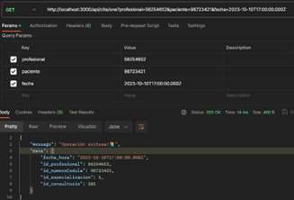

- get cita :doctores

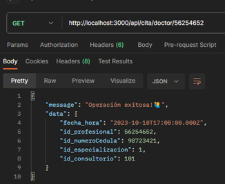

- get cita :pacientes

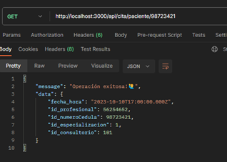

- get cita :especialización

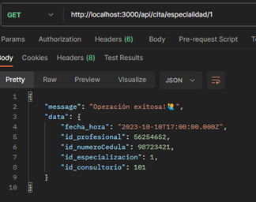

- post cita

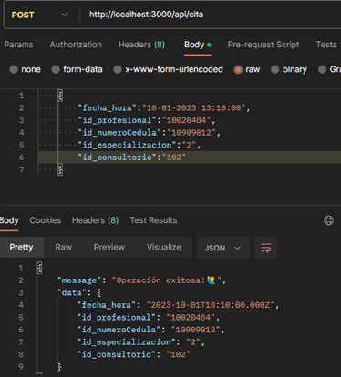

- put cita :id

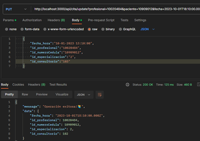

----
# Consultorio

- get consultorio

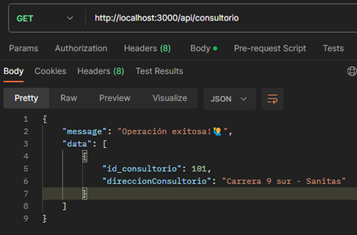

- get consultorio :id

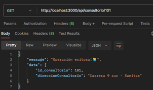

- post consultorio

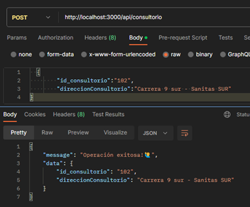

- put consultorio :id

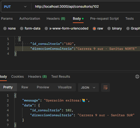
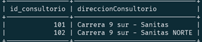

- delete consultorio

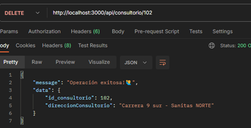
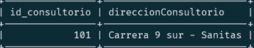

----
# Doctores

- get doctores

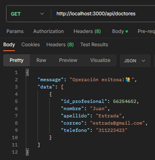

- get doctores :id

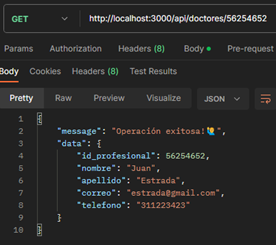

- post doctores

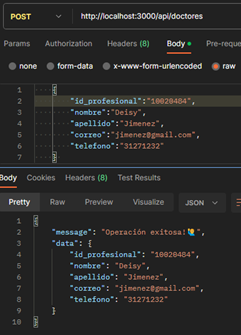

- put doctores :id

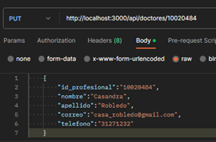
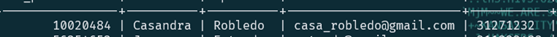

- delete doctores

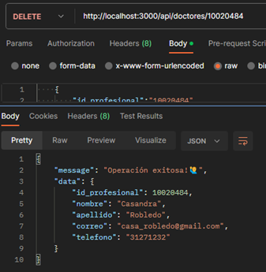
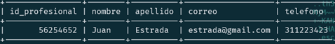


----
# Especialización

- get especialización

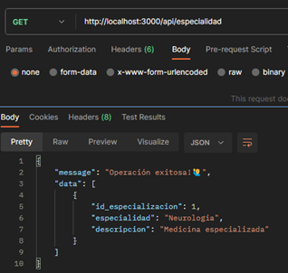

- get especialización :id

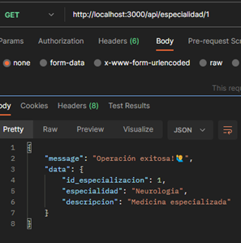

- post especialización 

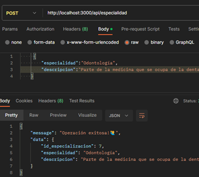

- put especialización :id

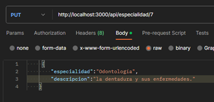
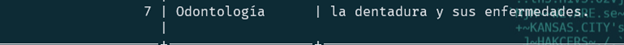

- delete especialización

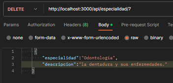
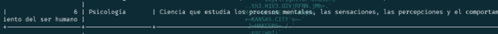

----
# Pacientes

- get pacientes

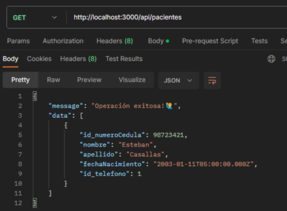

- get pacientes :id

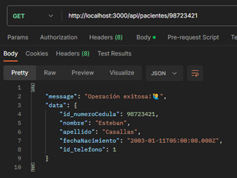

- post pacientes

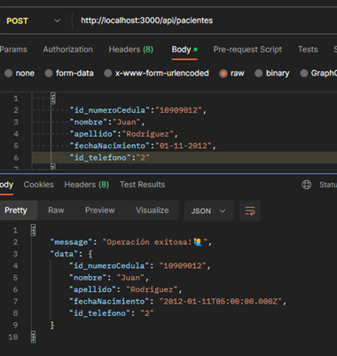

- put pacientes :id

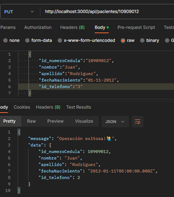


- delete pacientes

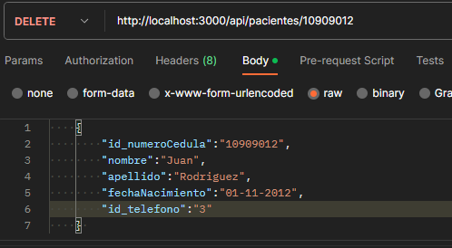

----
# Pacientes - Teléfono

- get Teléfono 

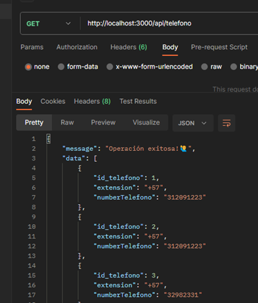

- get Teléfono :id

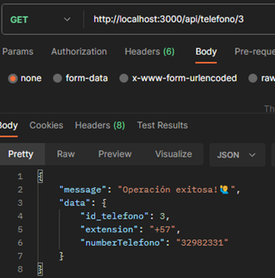

- post Teléfono

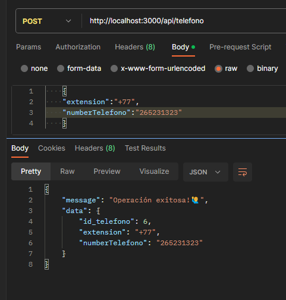

- put Teléfono :id

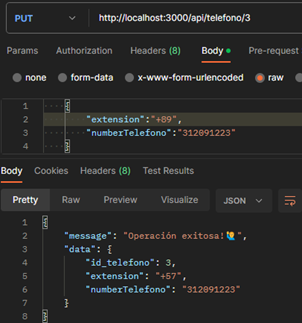


- delete Teléfono

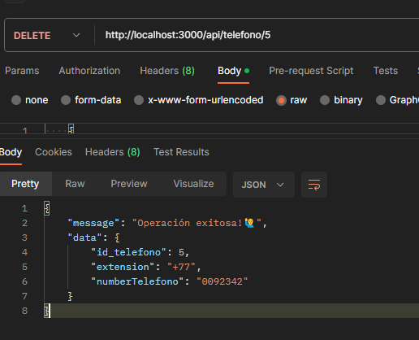


